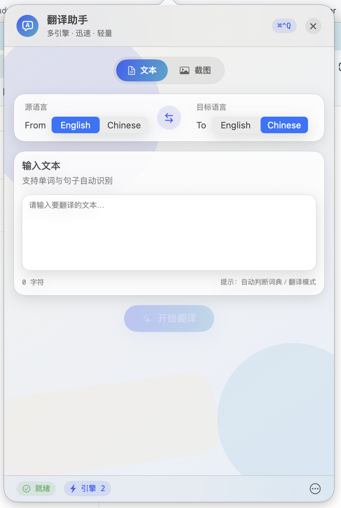

# 口袋翻译


口袋翻译，运行在 macOS 状态栏。

## 下载安装

[下载最新版本](https://github.com/Hao-yiwen/pocket_translator/releases/)

## 功能特点
- 多引擎支持
  - 🤖 OpenAI 大语言模型翻译
  - 🧠 通义千问 AI 翻译
  - 🌐 DeepL 专业翻译引擎
  - 🔄 Google 翻译服务

- 便捷操作
  - 📌 常驻 macOS 状态栏，随时待命
  - ⌨️ 全局快捷键（⌘⌃Q）快速唤起
  - 🔄 一键互换源语言和目标语言
  - 📋 智能剪贴板支持，快速粘贴和复制

- 界面设计
  - 🎯 简洁优雅的原生 macOS 风格
  - 💫 流畅的动画和交互效果
  - 🌓 自动适配系统明暗主题
  - 📱 紧凑而不失优雅的状态栏设计

- 高级特性
  - ⚡️ 多引擎并行翻译，结果实时对比
  - 🎛️ 可自定义 API 密钥配置

## 安装说明：

- 下载 TranslatorGenerator.dmg
- 打开 DMG 文件
- 将应用拖入 Applications 文件夹
- 首次运行时右键点击应用选择"打开"

## 使用说明
- 🔑 API 配置
  1. 点击状态栏图标
  2. 点击右下角 ... 设置按钮
  3. 配置所需的翻译服务 API：
    - OpenAI API Key [获取教程](https://platform.openai.com/api-keys)
    - 通义千问 API Key [获取教程](https://help.aliyun.com/zh/dashscope/developer-reference/acquisition-and-configuration-of-api-key)
    - DeepL API Key [获取教程](https://www.deepl.com/zh/pro-api)
    - Google 翻译 API Key [获取教程](https://cloud.google.com/translate/docs/setup)

- ⚡️ 快速上手
  1. 配置完 API 后即可使用
  2. 点击图标快速唤起翻译窗口
  3. 输入文本或粘贴剪贴板内容
  4. 选择源语言和目标语言
  5. 点击"翻译"按钮获取结果

- 💡 使用建议
  - 建议至少配置一个 API 以确保基本功能
  - 配置多个翻译服务可对比翻译结果
  - 可根据实际需求选择合适的翻译服务：
    - OpenAI/通义千问：适合理解上下文的智能翻译
    - DeepL：适合专业文档翻译
    - Google：适合日常文本翻译

- ⚠️ 注意事项
  - 请妥善保管 API 密钥
  - API 调用可能产生相应费用，请关注服务商的计费规则
  - 确保网络连接正常
  - 如遇到问题，可检查 API 配置是否正确

## 常见问题

如果提示"无法打开应用程序"，请尝试：

1. 右键点击应用选择"打开"
2. 在系统设置的安全性与隐私中允许打开
3. 如果仍然无法打开，请在终端中运行：

```bash
xattr -cr /Applications/pocket_translator.app
```

## 系统要求：

macOS 13.0 或更高版本

## 预览



## 支持我的工作

如果这个项目对你有帮助，可以请我喝杯咖啡 ☕️

<details>
<summary>
  
</summary>
<br>

</details>