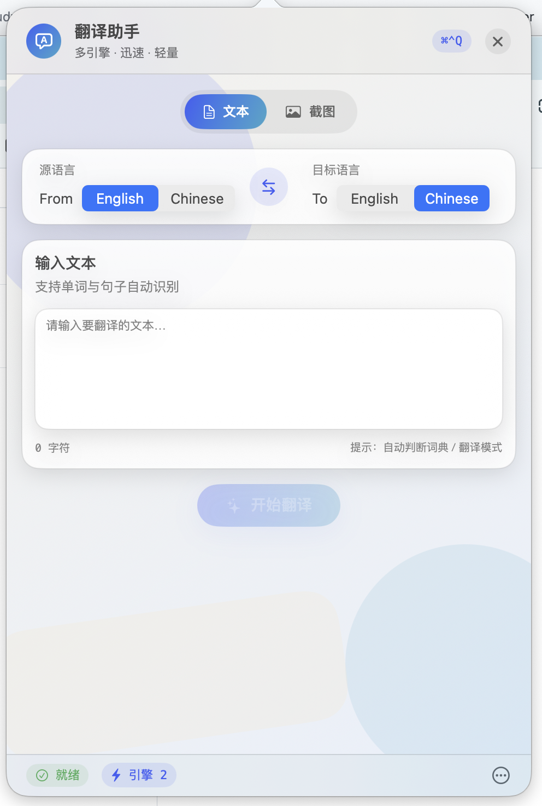

# 口袋翻译


口袋翻译，运行在 macOS 状态栏的轻量级多引擎翻译工具。

## 下载安装

[下载最新版本](https://github.com/Hao-yiwen/pocket_translator/releases/)

## 功能特点

- 多引擎支持
  - 🌐 Google 翻译服务（内置）
  - 🤖 自定义 AI 翻译供应商（支持 OpenAI 兼容 API）
    - DeepSeek、豆包、通义千问等
  - ⚡️ 多引擎并行翻译，结果实时对比

- 翻译模式
  - 📝 **文本翻译**：支持单词和句子/段落翻译
    - 单词模式：自动识别单词，返回词典格式翻译
    - 句子模式：自动识别句子/段落，进行流畅翻译
  - 🖼️ **图片翻译**：支持截图、粘贴、选择文件
    - 配置多模态 AI 模型（如豆包、Gemini）
    - 自动识别图片中的文字并翻译

- 智能特性
  - 🔧 技术术语优化：优先展示技术/软件领域含义
  - 📊 Markdown 渲染：翻译结果支持 Markdown 格式展示
  - ⚙️ 自定义参数：支持添加额外 API 参数（如 `reasoning_effort`）

- 便捷操作
  - 📌 常驻 macOS 状态栏，随时待命
  - ⌨️ 全局快捷键（⌘⌃Q）快速唤起
  - 🔄 一键互换源语言和目标语言
  - 📋 一键复制翻译结果

- 界面设计
  - 🎯 简洁优雅的原生 macOS 风格
  - 💫 流畅的动画和交互效果
  - 🌓 自动适配系统明暗主题

## 项目结构

```
pocket_translator/
├── Models.swift              # 数据模型、翻译服务、KeychainManager
├── Theme.swift               # 主题颜色、字体、可复用 UI 组件
└── pocket_translatorApp.swift # 主应用入口、TranslatorView、SettingsView
```

## 安装说明

1. 下载 TranslatorGenerator.dmg
2. 打开 DMG 文件
3. 将应用拖入 Applications 文件夹
4. 首次运行时右键点击应用选择"打开"

## 使用说明

### API 配置

1. 点击状态栏图标打开翻译窗口
2. 点击右下角 `...` 按钮进入设置
3. 配置翻译服务：

**Google 翻译（可选）**
- 输入 Google Cloud Translation API Key
- [获取教程](https://cloud.google.com/translate/docs/setup)

**AI 翻译供应商（文本翻译）**
- 点击"添加供应商"
- 填写名称、API 端点、模型名称和 API Key
- 可选：添加自定义参数（JSON 格式）
- 支持任何 OpenAI 兼容的 API 服务

**图片翻译服务**
- 点击"添加图片翻译服务"
- 配置支持视觉能力的多模态 AI 模型
- 需要模型支持图片输入（如豆包、Gemini、GPT-4o 等）

常用供应商配置示例：

| 供应商 | Base URL | 模型名称 |
|--------|----------|----------|
| DeepSeek | `https://api.deepseek.com/v1/chat/completions` | `deepseek-chat` |
| 豆包 | `https://ark.cn-beijing.volces.com/api/v3/chat/completions` | `doubao-seed-1.8` |
| 通义千问 | `https://dashscope.aliyuncs.com/compatible-mode/v1/chat/completions` | `qwen-turbo` |

自定义参数示例：
```json
{"reasoning_effort": "medium"}
{"temperature": 0.7, "max_tokens": 2000}
```

### 快速上手

1. 配置至少一个翻译服务的 API Key
2. 点击状态栏图标或使用快捷键 ⌘⌃Q 唤起窗口
3. 选择翻译模式（文本/截图）
4. 输入文本或选择图片
5. 选择源语言和目标语言
6. 点击"开始翻译"获取多引擎结果

### 图片翻译使用

1. 在设置中配置图片翻译服务
2. 切换到"截图"模式
3. 选择图片来源：
   - 📷 截图：框选屏幕区域
   - 📋 粘贴：从剪贴板粘贴
   - 📁 选择文件：从本地选择图片
4. 点击"开始翻译"

### 注意事项

- 请妥善保管 API 密钥（存储在系统 Keychain 中）
- API 调用可能产生相应费用，请关注服务商的计费规则
- 图片翻译需要屏幕录制权限（首次使用时会提示授权）
- 确保网络连接正常

## 系统要求

macOS 13.0 或更高版本

## 预览



## 支持我的工作

如果这个项目对你有帮助，可以请我喝杯咖啡

<details>
<summary>
  
</summary>
<br>

</details>
