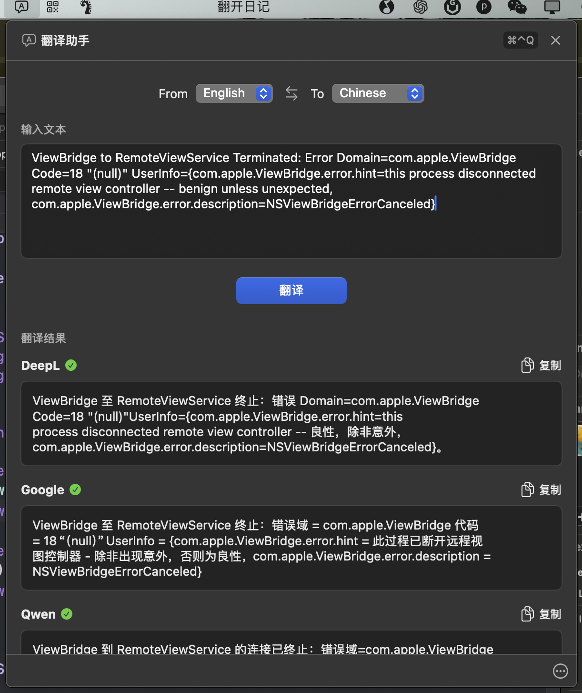

# 口袋翻译


口袋翻译，运行在 macOS 状态栏。

## 下载安装

[下载最新版本](https://github.com/Hao-yiwen/pocket_translator/releases/)

## 功能特点
- 多引擎支持
  - 🤖 OpenAI 大语言模型翻译
  - 🧠 通义千问 AI 翻译
  - 🌐 DeepL 专业翻译引擎
  - 🔄 Google 翻译服务

- 便捷操作
  - 📌 常驻 macOS 状态栏，随时待命
  - ⌨️ 全局快捷键（⌘⌃Q）快速唤起
  - 🔄 一键互换源语言和目标语言
  - 📋 智能剪贴板支持，快速粘贴和复制

- 界面设计
  - 🎯 简洁优雅的原生 macOS 风格
  - 💫 流畅的动画和交互效果
  - 🌓 自动适配系统明暗主题
  - 📱 紧凑而不失优雅的状态栏设计

- 高级特性
  - ⚡️ 多引擎并行翻译，结果实时对比
  - 🎛️ 可自定义 API 密钥配置

## 安装说明：

- 下载 TranslatorGenerator.dmg
- 打开 DMG 文件
- 将应用拖入 Applications 文件夹
- 首次运行时右键点击应用选择"打开"

## 常见问题

如果提示"无法打开应用程序"，请尝试：

1. 右键点击应用选择"打开"
2. 在系统设置的安全性与隐私中允许打开
3. 如果仍然无法打开，请在终端中运行：

```bash
xattr -cr /Applications/pocket_translator.app
```

## 系统要求：

macOS 13.0 或更高版本

## 预览



## 支持我的工作

如果这个项目对你有帮助，可以请我喝杯咖啡 ☕️

<details>
<summary>
  
</summary>
<br>

</details>

:::info
这周把我尘封的 1060 显卡笔记本拿出来搞 ai，结果发现太拉垮了，无论是 ubuntu 运行还是 ai 训练，6gb 的现存确实不够用，目前最起码 12gb 起步吧。

1060 训练 1b 模型都很费劲。
:::
